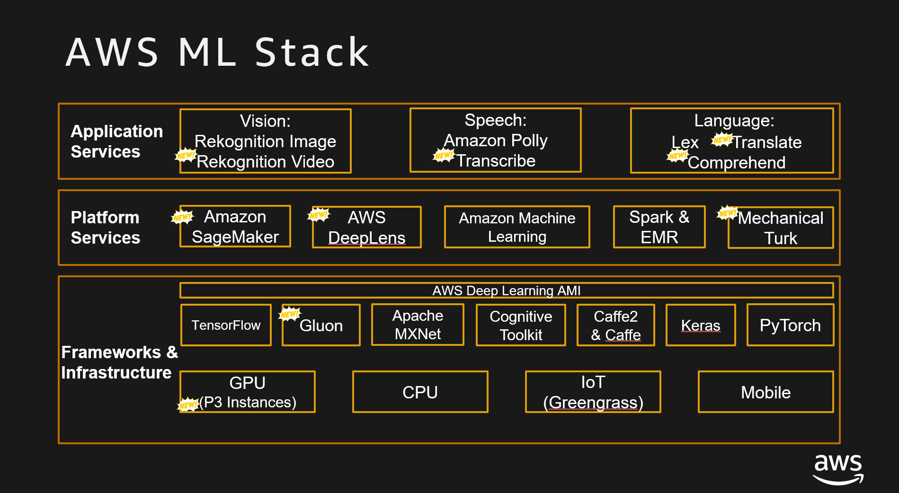

### The AWS ML Stack

AWS has created a suite of artificial intelligence and machine learning services that are referred to as the AI/ML Stack. This Stack of services enables customers to work with services solely where they need to, or at whatever level they are comfortable. AWS is committed to an optimal experience for users allowing them to go from authoring to benching to optimizing to deploying and managing many models.

There are essentially three layers in the stack:

1. **API-based services** designed for **application development**.

2. **Platform services** designed for **data scientists**.

3. **Frameworks/Infrastructure services** designed for **advanced/deep learning data scientists**.

### ML Core Competencies

Machine Learning Scientists work in the research and development of algorithms that are used in adaptive systems. For example, they build methods for predicting product suggestions (recommendations) and product demand (forecasting), and explore Big Data to automatically extract patterns (large-scale machine learning and pattern recognition). Some Machine Learning positions include Machine Learning Scientist, Research Science Manager, and Data Sciences Lead.

[This Post](http://blog.udacity.com/2016/04/5-skills-you-need-to-become-a-machine-learning-engineer.html)
on Udacity nicely outlines what is needed for a career in Machine Learning and helps containerize both the overall mindset and the specific skills needed to be successful.

Check out the resources below and on the next page to learn more.

Core Topic Area     |        Resources
--------------------|------------------------
Statistics          |[Intro to Descriptive Statistics](https://www.udacity.com/course/intro-to-descriptive-statistics--ud827)
Statistics          | [Intro to Inferential Statistics](https://www.udacity.com/course/intro-to-descriptive-statistics--ud827)
Algorithms|	[Data Structures](https://www.coursera.org/learn/data-structures)
Linear Algebra	|[Linear Algebra](https://ocw.mit.edu/courses/mathematics/18-06-linear-algebra-spring-2010/)
Calculus    |[Multivariable Calculus](https://ocw.mit.edu/courses/mathematics/18-02sc-multivariable-calculus-fall-2010/)
Probability and Statistics	|[Introduction to Probability - The Science of Uncertainty](https://www.edx.org/course/introduction-probability-science-mitx-6-041x-2)
Data modeling	|[Data Science: Inference and Modeling](https://www.edx.org/course/data-science-inference)
Software Development	|Languages include Python (Links to an external site.), Scala, Java, C++, R, Stata, MATLAB
System Design	|Requirement analysis, version control, testing/documentation
Communication skills	|Excellent verbal/written communication skills
Leadership skills	|	...and a natural curiosity and desire to learn

### Other AWS Competencies

AWS Skills such as **Compute**, **Storage**, **Database/Data Warehouse**, **Analytics**